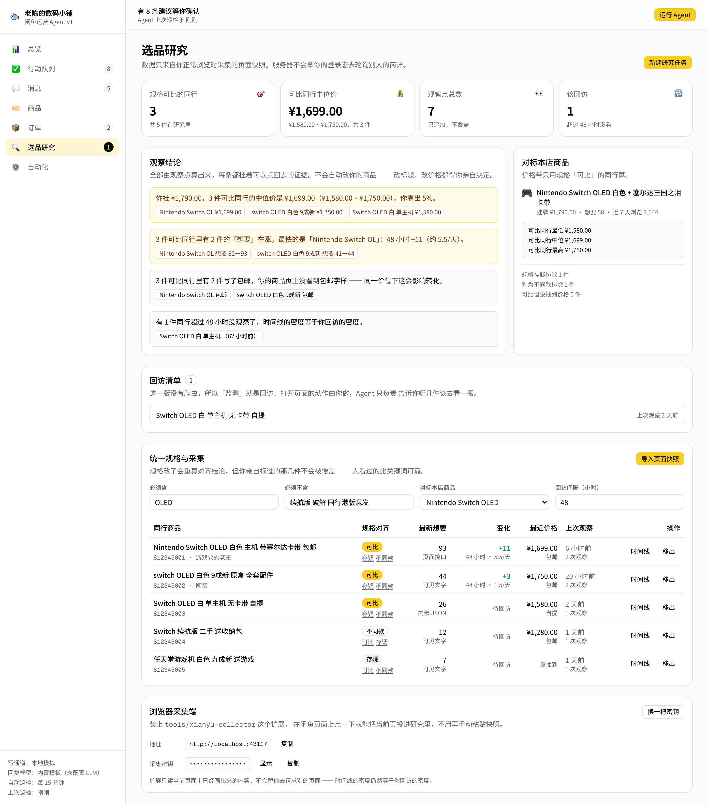

# 闲鱼运营 Agent v1 · Xianyu Ops Agent

给闲鱼卖家用的运营助手。它盯着你的商品、买家消息和订单，按你设定的规则把该做的事
整理成**带理由、可审批**的建议：擦亮什么、降价多少、怎么回复买家、哪笔订单该发货了。

高风险的动作永远不会自动执行 —— Agent 负责起草，你负责点头。


## 这是什么

- **总览**：曝光 / 成交额 / 待回复 / 待发货，14 天流量趋势，操作时间线
- **行动队列**：Agent 的每条建议都带着「为什么」，可以直接通过、改完再通过，或者忽略
- **消息**：识别买家意图（议价 / 咨询细节 / 催发货 / 问库存 / 售后），一键起草回复
- **商品**：擦亮、改价、下架；每个商品有**底价**，这是 Agent 的红线
- **订单**：发货时效倒计时，超时订单会被主动备单
- **自动化**：5 条规则的开关与参数，每条都能单独决定是否需要人工审批
- **自动巡检**：不点按钮也会按间隔自己跑，跑完留下记录；执行失败的动作带着原因留在队列里等你重试
- **通道与安全**：读写通道分开配置，支持演练模式、限流、急停和风控自动暂停
- **选品研究**：盯同行商品主页的「想要」，多次回访之间的差值就是热度变化；每个数字都能点回当时那一页

每条建议都写清楚了「为什么」—— 上架多少天、浏览多少次、买家出价多少、超时几小时：


规则的开关、参数、是否需要人工审批，以及自动巡检的间隔都在「自动化」页面里改：


同行热度看的是「想要」在多次回访之间的差值，每条结论后面都跟着可以点回去的证据：



## 快速开始

需要 **Node 22.12+**（`vitest` 的下限）。先确认一下：

```bash
node -v    # 低于 v22.12 的话先升级，比如 nvm install 22 && nvm use 22
```

然后在**项目目录**里（不是家目录）跑：

```bash
npm install
npm run dev
```

所有 `npm run ...` 命令都必须在项目根目录执行 —— 在别处跑会报
`Could not read package.json`。

浏览器打开 <http://localhost:43117>。用别的地址（局域网 IP、VPN 虚拟网卡）也可以，
`next.config.ts` 会在启动时读取本机所有 IPv4 地址并自动放行 —— 不放行的话 Next 会把
HMR 连接当跨源请求拦掉，页面会停在「渲染出来了但点不动」的状态。

打开 http://localhost:43117 。首次运行会自动生成一份示例店铺数据
（11 件商品、7 个会话、6 笔订单、14 天流量），存在 `.data/state.json`。

**不需要任何密钥或外部服务。** 点右上角「运行 Agent」就能看到它巡检一遍店铺。

服务端还会每 15 分钟自己跑一轮（间隔和开关在「自动化 → 自动巡检」里改）。
第一轮永远等你手动触发，之后才交给定时器，所以刚打开时队列是干净的。

在「自动化 → 店铺设置」里可以随时「重置示例数据」。

## 可选：接入 LLM

不配也能用 —— 回复由内置模板生成。配置之后，收件箱里点「让 Agent 起草」会在模板
基础上做一次口语化润色，调用失败会静默回落到模板：

```bash
# .env.local（已被 .gitignore 忽略）
OPENAI_API_KEY=sk-...
OPENAI_MODEL=gpt-4o-mini                     # 可选
OPENAI_BASE_URL=https://api.openai.com/v1    # 可选
```

任何兼容 OpenAI 协议的网关都能直接用，改 `OPENAI_BASE_URL` 和 `OPENAI_MODEL` 即可
（MiniMax `https://api.minimaxi.com/v1`、DeepSeek `https://api.deepseek.com/v1` 等都实测可用）。

### 模型只能改措辞，改不了数字

润色结果要过三道关才会被采用，任何一关没过就整段弃用、回落到模板：

1. **剥掉思考块**：MiniMax-M3、DeepSeek-R1 这类推理模型会把 `<think>…</think>` 混在正文里，
   直接发出去买家就看到了；没闭合说明输出被截断，整段弃用。
2. **不许出现草稿里没有的数字**：模型编一个「最低 3500」出来，底价保护就白做了。
   这一关只看数值不看写法，所以「¥3,850.00」被改写成「3850」或「3,850 元」都算通过，
   但把「24 小时内发出」改成「48 小时」会被拦下。
3. **还价必须保住**：按底价算出来的那个数字少了就弃用。

回落的代价只是话说得官方一点，放过一个编出来的低价代价是真金白银 —— 所以宁可多回落。

### 回落了会告诉你为什么

额度用光、key 失效、超时、模型改了数字 —— 每一种回落都会在起草的提示里说清原因，
服务端日志里也留一条。**「配了 LLM 却每次都是模板」和「没配 LLM」不能长得一样**，
否则你会以为模型在干活：

```
草稿已生成。 模型调用失败（HTTP 429：已达到 Token Plan 用量上限），已回落到模板。
```

## 关于真实账号

**默认不会碰你的真实闲鱼账号。** 读和写是两条独立的通道，在「自动化 → 通道与安全」里分别配置。

### 写模式

| 模式 | 行为 | 什么时候用 |
| --- | --- | --- |
| 本地模拟 | 改本地数据，并模拟平台反应（擦亮带来曝光回升、发货扣库存） | 演示和开发，默认 |
| 演练 | 只记录「本来要干什么」，一个字段都不改 | 接真实账号之前，先看清楚 Agent 到底想做哪些事 |
| 真实写入 | —— | 通道还没实现，选了会被明确拒绝 |

### 四道安全阀

1. **急停** —— 一个按钮停掉所有写操作，界面顶部会一直横着提示；
2. **限流** —— 滑动窗口限制每分钟写入次数，外加两次写操作之间的最小间隔。
   只在演练和真实模式下生效，本地模拟没有账号需要保护；
3. **风控自动暂停** —— 通道报回 `riskControl` 标记（滑块、验证码、异常 403）时立刻急停，
   继续重试只会把事情搞得更糟；
4. **连续失败熔断** —— 连续失败到设定次数自动急停，成功一次就清零。

被急停或限流拦下的动作**不会**变成失败项，而是这一轮直接跳过 —— 状态没变，下一轮自然会重新提出来。

### 底价未确认的商品不会被自动降价

从平台同步进来的新商品只有挂牌价，底价是按九折估的，会标成「底价待确认」。
在你亲自确认之前，自动降价规则会绕开它 —— 拿一个猜出来的底价去降价，等于没有底价。

### 真实读通道（v1.3，进行中）

**写通道仍然没有真实实现**，选「真实写入」会被明确拒绝。这一版做的是**只读**接入。

闲鱼网页版走的是淘系的 MTOP 网关。传输层、签名、登录态、重试和风控识别都已经实现，
协议细节是对着真实网关探出来的，不是猜的：

```
POST https://h5api.m.goofish.com/h5/{api}/{version}/?appKey=34839810&t=…&sign=…
     body: data=<urlencoded JSON>
→ {"api":"…","ret":["SUCCESS::接口调用成功"],"data":{…}}
```

`appKey` 是 **34839810**，参与签名，填错了签名永远算不对。
（这里一度写成 `12574478` —— 那是淘宝 h5 的 appKey，从示例里抄来的，
所以任何需要登录的调用都注定失败。闲鱼自己的打包产物里根本没出现过那个值。）

#### 导入登录态

最省事的办法是配合 Chrome 扩展
[Xianyu Login State Extractor](https://chromewebstore.google.com/detail/xianyu-login-state-extrac/eidlpfjiodpigmfcahkmlenhppfklcoa)：

```bash
# 1. 浏览器登录 www.goofish.com，点扩展 → 勾选同意 → 提取（内容进剪贴板）
# 2. 回终端粘贴，Ctrl-D 结束
npm run xianyu:login

# 顺带真的调一次网关验证登录态是不是活的
npm run xianyu:login -- --verify

npm run xianyu:login -- --status    # 看当前状态
npm run xianyu:login -- --clear     # 删掉
```

导入的内容存在 `.secrets/xianyu-login-state.json`，权限 `600`，目录已在 `.gitignore` 里。
解析器对着扩展 v1.1 的真实导出结构验证过：cookie 数组里的 `domain` / `httpOnly` 这些属性
不会混进 cookie 串，`storage` 里的令牌不会被当成 cookie，`env.navigator.userAgent` 也能捞出来。
`Accept-Encoding` 会被丢掉 —— 浏览器报的 `zstd` Node 的 fetch 不一定解得开，照抄反而会把响应搞坏。

**为什么推荐这个扩展，而不是只手抄 cookie：** 它会把 cookie 和当时的**请求头**
（User-Agent / Accept-Language / Sec-CH-UA 等）一起导出。cookie 是在某个具体浏览器里
登录出来的，拿着它却用另一套 User-Agent 去请求，这种不一致本身就是风控的典型触发条件。
导入的请求头会原样带到每一次请求上。

> ⚠️ 这是第三方扩展，作者身份不明。商店页面声明数据只在本地生成、不上传，但你应该
> 自己判断是否可信。稳妥的用法是：用完就把扩展停用或删掉。**导出的内容等同于你的账号，
> 不要发给任何人，也不要贴进任何对话框。**

手抄也行，扩展只是省事：

```bash
# .env.local（环境变量优先级高于 .secrets/ 里的文件）
XIANYU_COOKIE=整条 cookie 串
XIANYU_USER_AGENT=你浏览器的 User-Agent   # 强烈建议一起配
```

#### 接口名配置

商品和会话都有默认值，不用配。只有**卖出订单**的接口名还没确认：

```bash
XIANYU_API_ORDERS=mtop.xxx@1.0        # 可选，没配就保留本地订单
XIANYU_API_LISTINGS=mtop.xxx          # 可选，覆盖默认的商品列表接口
XIANYU_API_CONVERSATIONS=mtop.xxx@3.0 # 可选，覆盖默认的会话接口
```

`@` 后面是版本号，不写按 `1.0`。会话接口是 `3.0`，所以这个必须支持。

#### 排查工具

```bash
npm run xianyu:probe                      # 检查凭证 + 验证已知接口是否存在
npm run xianyu:probe -- --api mtop.xxx    # 验证某个接口名存不存在（不需要登录）
npm run xianyu:probe -- --call mtop.xxx   # 带凭证真的调一次，打印返回结构
```

网关会区分「接口不存在」「令牌为空」和「Session 过期」，所以**不登录就能验证接口名
是否真实存在**。已对着真实网关确认存在的：

| 接口 | 版本 | 用途 |
| --- | --- | --- |
| `mtop.idle.web.xyh.item.list` | 1.0 | 商品列表（默认使用） |
| `mtop.taobao.idlemessage.pc.session.sync` | 3.0 | **会话列表**（默认使用） |
| `mtop.taobao.idlemessage.pc.message.sync` | 1.0 | 某个会话里的历史消息 |
| `mtop.taobao.idle.pc.detail` | 1.0 | 商品详情 |
| `mtop.taobao.idlemessage.pc.login.token` | 1.0 | 私信令牌（WebSocket 用） |
| `mtop.idle.web.user.page.head` / `.nav` | 1.0 | 用户主页 / 导航 |
| `mtop.idle.web.trade.bought.list` | 1.0 | **买到的**订单（不是卖出的） |
| `mtop.taobao.idle.trade.user.adjust.price` | 1.0 | 订单改价（写操作，未接入） |

会话接口一直没探到，是因为之前照着「订单列表」的思路猜名字，而闲鱼的私信走的是
另一套 `idlemessage` 命名空间。

**卖出订单**的接口名仍未确认。`bought.list` 是买到的，硬拿来用会把你买的东西当成
销售单。所以没配就是没配 —— 与其硬编码一个猜的名字让它在运行时莫名其妙地失败，
不如明确地说「没配」。没配的部分同步时会保留本地数据，不会清空。

会话列表只给「最后一条消息」的摘要，所以同步进来的会话里就只有那一条 ——
**不假装拿到了完整聊天记录**。完整对话要另外调 `message.sync`，还没接。

#### 实测记下来的坑

| 坑 | 真相 |
| --- | --- |
| 商品列表必填参数 | `userId`（= cookie 里的 `unb`）+ `pageNumber` + `pageSize`，少一个是 `FAIL_BIZ_BAD_REQUEST` |
| 每页上限 | `pageSize` 填 40 被拒（最大可查看商品数超限），20 可以 |
| 会话列表必填参数 | 只认 `fetchNum`，`sessionTypes` 给不给都一样 |
| `ownerInfo` 不一定是我 | 有的会话里自己在 `userInfo` 那边，对方只能靠「userId ≠ unb」认 |
| 混着系统会话 | `sessionType` 23 / 25 / 62 是官方通知、物流、活动，只收 `1`（单聊） |
| 列表不给热度数据 | 浏览 / 想要 / 库存只有详情接口有，只对**在售**商品逐件补，且有上限 |
| `itemStatus: 1` | 是「卖掉了」，用详情接口的 `itemStatusStr` 核对过 |

热度数据有一点要自己心里有数：详情接口给的 `browseCnt` 是**累计**浏览，不是近 7 天。
平台没有 7 天口径的数字，所以滞销降价的阈值要按累计量重新设。

#### 安全行为

- **风控绝不重试**：`RGV587_ERROR`、`FAIL_SYS_ILLEGAL_ACCESS` 这类返回一出现就立刻停手，
  并且**自动按下急停**。撞上滑块还继续请求，只会让账号更危险。
- **登录失效绝不重试**：重试也没用，直接告诉你要重新扫码。
- **限流退避重试**：指数退避 + 抖动，次数用完就放弃。
- **token 过期自动换发**：网关 `Set-Cookie` 下来的新 `_m_h5_tk` 会用于重新签名。
- **凭证隔离**：只从环境变量或 `.secrets/`（权限 600、已 gitignore）读，
  不进 `.data/state.json`，界面上只显示「有没有配」和诊断文字，日志里一律脱敏。
- **后台巡检不碰真实账号**：`runTick` 根本拿不到读通道，同步只能由你手动点
  「从平台同步」触发。切到真实读通道不会让它在后台偷偷发请求。

#### 映射层认不出来就跳过

真实接口的返回结构没有公开文档，只能靠抓包，而且会变。所以每个字段都给一组候选路径，
**认不出来的记录直接跳过并计数**，绝不硬塞一个猜出来的值 ——
一个编出来的价格比没有数据危险得多。

## 选品研究：怎么看同行的热度

闲鱼没有给卖家看别人流量的入口。能拿到的公开代理指标是商品主页上的**「想要」** ——
人眼就能看到、不需要任何权限。单次数字没有意义，有意义的是**同一件商品、多次回访、
可回链**的差值。

### 数据只有一个入口：你正常浏览时采集

服务器**不会拿你的登录态去轮询别人的商详** —— 那是爬站，会把账号送进风控。
所以同行数据只能这样进来：你在闲鱼正常浏览，采集当前页面上已经画出来的内容，
本机解析入库。

由此有一个必须接受的事实：**时间线的密度等于你回访的密度。** 所以「监测」在这里
被定义成一份**回访清单**，而不是爬虫 —— 打开页面的动作由你做。

### 采集端：一个按钮，不用手动粘贴

`tools/xianyu-collector` 是配套的 Chrome 扩展：在闲鱼的商品详情页或搜索结果页上
点一下，当前页就进研究里了。装法看
[它的 README](tools/xianyu-collector/README.md)，三步：

```bash
npm run dev                                  # 1. 应用跑起来
# 2. 打开 /research，在页面底部「浏览器采集端」复制采集密钥
# 3. chrome://extensions → 开发者模式 → 加载已解压的扩展程序 → 选 tools/xianyu-collector
```

扩展做的事只有旁听：记下页面**自己已经发出并拿回来**的响应、读页面内嵌的初始 JSON、
读可见的文字。**不预取、不轮询、不翻页**，不改请求也不碰 cookie，只 POST 到你自己填的
那个 `localhost` 地址。

采集密钥是因为 `localhost` 对任何网页都是可达的 —— 没有它，你随便打开的某个网站也能
往你的研究里塞脏数据。它**不是**平台凭证：既不能登录闲鱼，也动不了你的商品。
想换就在界面上点「换一把密钥」。

搜索结果页点一下会把当页所有卡片一次性加进来，适合开局批量铺同行；之后要盯的那几件
还是得进商详页点，因为趋势只按商详对商详算。

### 快照格式

不想装扩展也行 —— 手动粘贴进「导入页面快照」，格式一样：

```json
{
  "capturedAt": "2026-09-15T04:00:00.000Z",
  "pageUrl": "https://www.goofish.com/item?id=812345001",
  "pageType": "detail",
  "api":       { "data": { "itemDO": { "itemId": "812345001", "wantCnt": 97 } } },
  "hydration": { },
  "dom":       { "itemId": "812345001", "wants": 97, "price": 1699 },
  "visibleText": "97人想要 · 包邮 · 九成新"
}
```

搜索结果页把多张卡片放进 `items` 数组，每张可以自带 `layer` 声明它是从哪儿读的。

### 三层抽取，认不出就说认不出

| 层 | 来源 | 稳定性 |
| --- | --- | --- |
| `api` | 你打开页面时，页面**自己已经拉回来**的响应 | 最稳。不新开请求，只读已经发生的响应 |
| `hydration` | 页面里内嵌的初始 JSON | 次之 |
| `dom` | 采集端从页面上读到的字段，以及可见文字里的 `86人想要` | 兜底。命中的原文片段进证据，方便点回去核对 |

界面上每个数字都标着它是哪一层给的。截图可以当人眼核对的附件，但**不用来 OCR 出数字**。

### 四条硬规则

1. **观察只追加，不覆盖。** 这一版的全部价值就是历史差值，覆盖等于把历史抹掉；
2. **缺失不当 0。** 抽不到「想要」就留空并标成缺失 —— 记成 0 的话，下一次读到 86
   就会显示「涨了 86」；
3. **只比较商详对商详。** 搜索卡片上的「想要」有时不展示、有时是另一套字段，
   混算会造出假涨跌。搜索页的观察照样存着，但不参与趋势计算；
4. **对不齐就不比。** 规格对齐靠标题关键词判定：命中任一「必须不含」判为不同款，
   命中全部「必须含」判为可比，其余一律**存疑**。只有「可比」的同行进价格带 ——
   拿日版当国行比，比不比更糟。你亲自标过的结论不会被关键词判定覆盖。

同一件商品、同一来源、10 分钟内的重复观察会合并成一条，留下字段更完整的那条 ——
刷新一下页面不该在时间线上变成一次「波动」。

### 结论不会自动改你的商品

「观察结论」全部由观察点算出来，每条都挂着可以点回原页的证据：你比可比同行的中位价
高多少、谁的「想要」在涨、多少件写了包邮。可比同行不足两件时只说「样本不够」，
**没有证据就不出结论**。

这些结论**只在研究台展示，不进行动队列** —— 改标题、改价格都得你亲自决定。
同行商品也不会进本店商品表，否则规则引擎会拿别人的货去提案擦亮和降价。

### 不做的事

- 后台定时去拉同行商详（那是爬站）
- 让模型看图猜「想要」或流量（数字只认页面上抽出来的字段）
- 根据同行数据自动改你的标题、主图、价格

#### 协议细节的来源

接口名、appKey、签名算法和请求形态，一部分是自己对着网关探出来的，一部分来自
[cv-cat/XianYuApis](https://github.com/cv-cat/XianYuApis) —— 那个项目里带了闲鱼网页版
的打包产物，`session.sync` / `message.sync` 这些名字和 `34839810` 这个 appKey 就是
从里面读出来的。每一条都用 `npm run xianyu:probe` 对着真实网关验过存在性，没有照抄。

**私信的实时收发走的不是 HTTP**，而是钉钉那套 WebSocket（`wss://wss-goofish.dingtalk.com`），
消息体是 base64 + Protobuf。这一版只用 `session.sync` 读会话列表快照；实时收发还没接。

### 接真实写通道还要做什么

实现 `src/lib/adapters/types.ts` 里的 `XianyuAdapter`。规则引擎、安全阀和界面都不需要
改动 —— 写通道会自动套上 `GuardedAdapter` 的护栏。

## 开发

```bash
npm run dev         # 开发服务器（端口 43117）
npm run test        # vitest：规则引擎、回复起草、调度、安全阀、同步合并、MTOP 协议、登录态解析、选品研究，197 个用例
npm run lint        # eslint
npm run typecheck   # tsc --noEmit
npm run check       # 上面三件一起跑
npm run build       # 生产构建
npm run test:e2e    # 浏览器冒烟测试（需要先起服务，见下）
```

`npm run test:e2e` 用 `playwright-core` 驱动本机已装的 Chrome，把审批、回复、擦亮、
发货、规则开关、选品研究、采集端 API 和移动端布局跑一遍（96 项）。它会先点一次
「重置示例数据」，所以可以重复运行：

```bash
npm run build && npm run start &   # 或者 npm run dev
npm run test:e2e
CHROME_PATH=/path/to/chrome npm run test:e2e   # Chrome 不在默认位置时
```

`node scripts/screenshots.mjs` 会重新生成 README 里的截图。

### 目录结构

采集端读页面那段代码（`tools/xianyu-collector/collect.js`）也在 e2e 里跑，
但是对着**本地伪造的页面**跑 —— 拦掉请求本地应答，一个字节都不会发到 goofish.com。
在真站点上跑自动化，正是这套设计要避免的事。

```
src/
├── instrumentation.ts      服务端启动时把后台巡检跑起来
├── app/                    页面（Server Components）与 Server Actions
│   ├── actions.ts          所有写操作的入口
│   ├── api/research/       采集端投快照的本机接口（密钥校验）
│   ├── page.tsx            总览
│   ├── queue/              行动队列
│   ├── inbox/              消息
│   ├── listings/           商品
│   ├── orders/             订单
│   ├── research/           选品研究：同行「想要」观察
│   └── automations/        自动化规则与店铺设置
├── components/             UI 组件（shadcn/ui + 业务组件）
└── lib/
    ├── domain/             领域模型与示例数据
    ├── adapters/
    │   ├── guard.ts        安全阀：急停 / 演练 / 限流 / 风控暂停
    │   ├── mock.ts         模拟写通道
    │   ├── mock-reader.ts  模拟读通道
    │   └── live/           真实读通道
    │       ├── mtop.ts         签名、错误码分类、重试决策
    │       ├── login-state.ts  登录态解析与存储（cookie + 请求头）
    │       ├── credentials.ts  凭证检查与脱敏
    │       ├── paths.ts        候选路径取值
    │       ├── mapping.ts      返回结构 → 领域模型
    │       └── reader.ts       LiveXianyuReader
    ├── research/           选品研究（和本店商品完全分开）
    │   ├── snapshot.ts     页面快照解析：三层抽取
    │   ├── record.ts       按 itemId 追加观察、短时去重、规格对齐
    │   ├── analysis.ts     想要趋势、价格带、回访清单、带证据的结论
    │   └── collector.ts    采集端配对密钥与请求校验
    ├── agent/
    │   ├── engine.ts       规则引擎：状态 + 时间 → 建议
    │   ├── reply.ts        意图识别与回复起草
    │   ├── tick.ts         一轮巡检：手动和自动共用同一条路径
    │   ├── sync.ts         把平台快照合进本地状态
    │   ├── scheduler.ts    后台定时器，按间隔触发巡检
    │   └── llm.ts          可选的 LLM 润色
    └── store.ts            JSON 文件存储
tests/                      vitest 单元测试 + e2e.mjs 浏览器冒烟测试
tools/xianyu-collector/     浏览器采集端（Chrome 扩展，只读当前页）
scripts/screenshots.mjs     重新生成 README 截图
scripts/xianyu-probe.mjs    接口名探测与排查
scripts/xianyu-login.mjs    导入 / 验证 / 清除登录态
docs/plans/                 执行计划
```

### 五条写死的安全约束

1. 自动降价**永远不会低于商品底价**，适配层会二次拦截手动改价；
   底价没经你确认的商品，自动降价直接绕开；
2. 售后、需要人工核实的细节咨询、低置信度的草稿**强制进审批队列**，
   哪怕对应规则被设成了自动执行；
3. 执行失败的动作**不会被悄悄丢掉**，会带着失败原因和尝试次数留在队列里，
   可以原样重试或者改完再试；
4. 所有写操作都必须穿过 `GuardedAdapter`，急停、限流、风控暂停一个都绕不过去；
5. 同行数据只能由你在正常浏览时采集进来，**服务器不会主动去请求别人的商详**；
   抽不到的字段如实留空，绝不写成 0。

### 时间一律按北京时间显示

界面上的「下单 09/14 16:05」这类时间钉死在 `Asia/Shanghai`，不跟着看页面的人所在时区变。
一是对闲鱼卖家来说这本来就该是北京时间，二是不钉死的话服务端（UTC）和浏览器会渲染出
不同的字符串，React hydration 会直接报错。`npm run test:e2e` 特意用中国时区的浏览器跑，
就是为了守住这条。

## 技术栈

Next.js 16（App Router）· React 19 · TypeScript · Tailwind CSS v4 · shadcn/ui · Vitest

数据存在本地 JSON 文件里，换成真正的数据库只需要替换 `src/lib/store.ts`。
