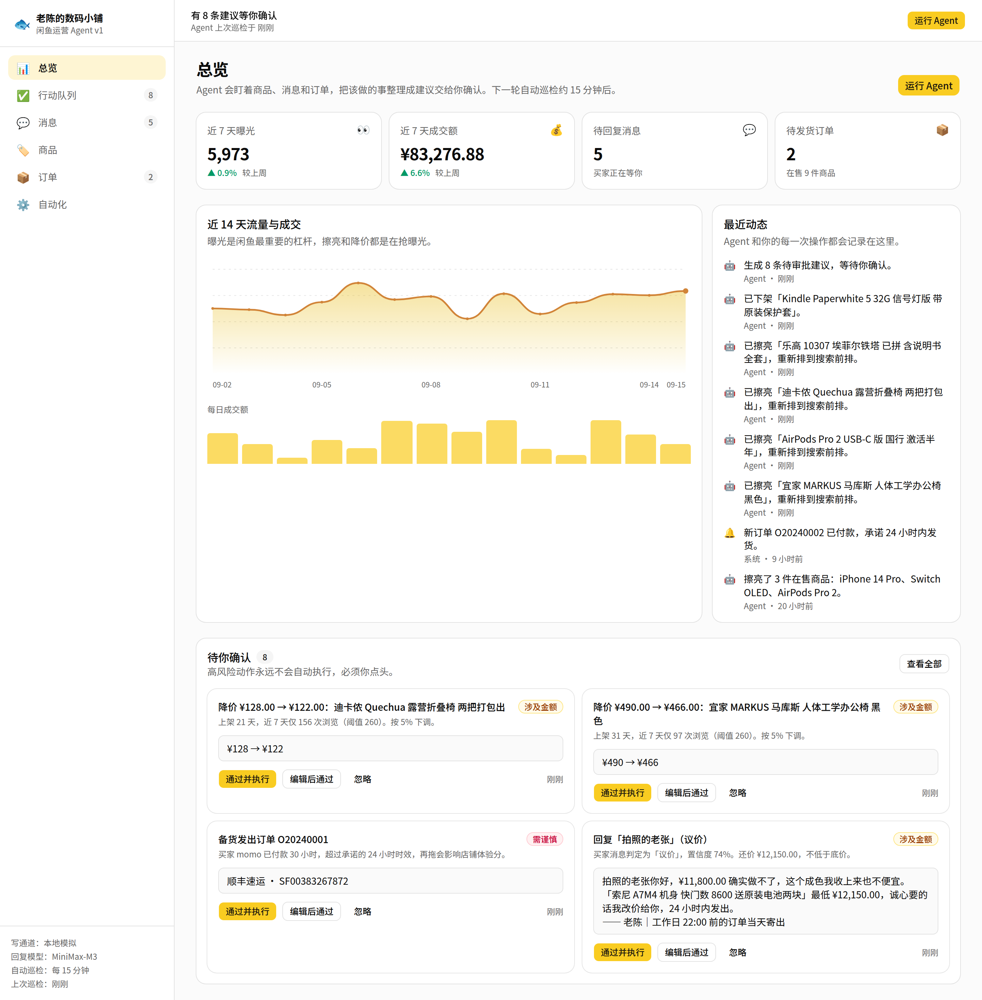
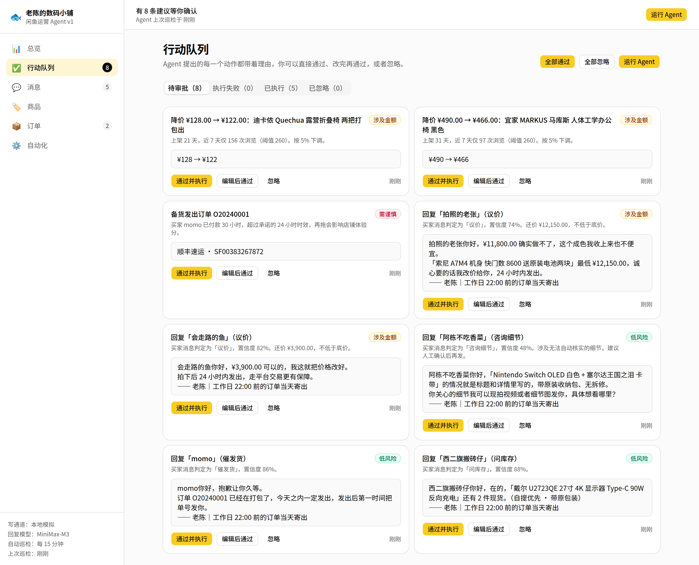
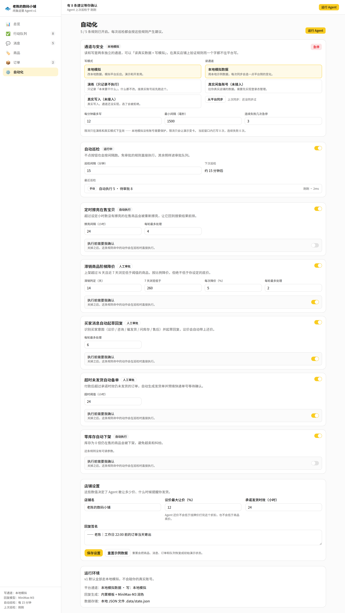

# 闲鱼运营 Agent v1 · Xianyu Ops Agent

给闲鱼卖家用的运营助手。它盯着你的商品、买家消息和订单，按你设定的规则把该做的事
整理成**带理由、可审批**的建议：擦亮什么、降价多少、怎么回复买家、哪笔订单该发货了。

高风险的动作永远不会自动执行 —— Agent 负责起草，你负责点头。



## 这是什么

- **总览**：曝光 / 成交额 / 待回复 / 待发货，14 天流量趋势，操作时间线
- **行动队列**：Agent 的每条建议都带着「为什么」，可以直接通过、改完再通过，或者忽略
- **消息**：识别买家意图（议价 / 咨询细节 / 催发货 / 问库存 / 售后），一键起草回复
- **商品**：擦亮、改价、下架；每个商品有**底价**，这是 Agent 的红线
- **订单**：发货时效倒计时，超时订单会被主动备单
- **自动化**：5 条规则的开关与参数，每条都能单独决定是否需要人工审批
- **自动巡检**：不点按钮也会按间隔自己跑，跑完留下记录；执行失败的动作带着原因留在队列里等你重试
- **通道与安全**：读写通道分开配置，支持演练模式、限流、急停和风控自动暂停

每条建议都写清楚了「为什么」—— 上架多少天、浏览多少次、买家出价多少、超时几小时：



规则的开关、参数、是否需要人工审批，以及自动巡检的间隔都在「自动化」页面里改：



## 快速开始

```bash
npm install
npm run dev
```

打开 http://localhost:43117 。首次运行会自动生成一份示例店铺数据
（11 件商品、7 个会话、6 笔订单、14 天流量），存在 `.data/state.json`。

**不需要任何密钥或外部服务。** 点右上角「运行 Agent」就能看到它巡检一遍店铺。

服务端还会每 15 分钟自己跑一轮（间隔和开关在「自动化 → 自动巡检」里改）。
第一轮永远等你手动触发，之后才交给定时器，所以刚打开时队列是干净的。

在「自动化 → 店铺设置」里可以随时「重置示例数据」。

## 可选：接入 LLM

不配也能用 —— 回复由内置模板生成。配置之后，收件箱里点「让 Agent 起草」会在模板
基础上做一次口语化润色，调用失败会静默回落到模板：

```bash
# .env.local（已被 .gitignore 忽略）
OPENAI_API_KEY=sk-...
OPENAI_MODEL=gpt-4o-mini                     # 可选
OPENAI_BASE_URL=https://api.openai.com/v1    # 可选
```

任何兼容 OpenAI 协议的网关都能直接用，改 `OPENAI_BASE_URL` 和 `OPENAI_MODEL` 即可
（MiniMax `https://api.minimaxi.com/v1`、DeepSeek `https://api.deepseek.com/v1` 等都实测可用）。

### 模型只能改措辞，改不了数字

润色结果要过三道关才会被采用，任何一关没过就整段弃用、回落到模板：

1. **剥掉思考块**：MiniMax-M3、DeepSeek-R1 这类推理模型会把 `<think>…</think>` 混在正文里，
   直接发出去买家就看到了；没闭合说明输出被截断，整段弃用。
2. **不许出现草稿里没有的数字**：模型编一个「最低 3500」出来，底价保护就白做了。
   这一关只看数值不看写法，所以「¥3,850.00」被改写成「3850」或「3,850 元」都算通过，
   但把「24 小时内发出」改成「48 小时」会被拦下。
3. **还价必须保住**：按底价算出来的那个数字少了就弃用。

回落的代价只是话说得官方一点，放过一个编出来的低价代价是真金白银 —— 所以宁可多回落。

## 关于真实账号

**默认不会碰你的真实闲鱼账号。** 读和写是两条独立的通道，在「自动化 → 通道与安全」里分别配置。

### 写模式

| 模式 | 行为 | 什么时候用 |
| --- | --- | --- |
| 本地模拟 | 改本地数据，并模拟平台反应（擦亮带来曝光回升、发货扣库存） | 演示和开发，默认 |
| 演练 | 只记录「本来要干什么」，一个字段都不改 | 接真实账号之前，先看清楚 Agent 到底想做哪些事 |
| 真实写入 | —— | 通道还没实现，选了会被明确拒绝 |

### 四道安全阀

1. **急停** —— 一个按钮停掉所有写操作，界面顶部会一直横着提示；
2. **限流** —— 滑动窗口限制每分钟写入次数，外加两次写操作之间的最小间隔。
   只在演练和真实模式下生效，本地模拟没有账号需要保护；
3. **风控自动暂停** —— 通道报回 `riskControl` 标记（滑块、验证码、异常 403）时立刻急停，
   继续重试只会把事情搞得更糟；
4. **连续失败熔断** —— 连续失败到设定次数自动急停，成功一次就清零。

被急停或限流拦下的动作**不会**变成失败项，而是这一轮直接跳过 —— 状态没变，下一轮自然会重新提出来。

### 底价未确认的商品不会被自动降价

从平台同步进来的新商品只有挂牌价，底价是按九折估的，会标成「底价待确认」。
在你亲自确认之前，自动降价规则会绕开它 —— 拿一个猜出来的底价去降价，等于没有底价。

### 接真实通道要做什么

实现 `src/lib/adapters/types.ts` 里的两个接口：`XianyuReader`（读）和 `XianyuAdapter`（写）。
规则引擎、安全阀和界面都不需要改动 —— 写通道会自动套上 `GuardedAdapter` 的护栏。

## 开发

```bash
npm run dev         # 开发服务器（端口 43117）
npm run test        # vitest：规则引擎、回复起草、调度、失败处理、安全阀、同步合并，96 个用例
npm run lint        # eslint
npm run typecheck   # tsc --noEmit
npm run check       # 上面三件一起跑
npm run build       # 生产构建
npm run test:e2e    # 浏览器冒烟测试（需要先起服务，见下）
```

`npm run test:e2e` 用 `playwright-core` 驱动本机已装的 Chrome，把审批、回复、擦亮、
发货、规则开关和移动端布局跑一遍。它会先点一次「重置示例数据」，所以可以重复运行：

```bash
npm run build && npm run start &   # 或者 npm run dev
npm run test:e2e
CHROME_PATH=/path/to/chrome npm run test:e2e   # Chrome 不在默认位置时
```

`node scripts/screenshots.mjs` 会重新生成 README 里的截图。

### 目录结构

```
src/
├── instrumentation.ts      服务端启动时把后台巡检跑起来
├── app/                    页面（Server Components）与 Server Actions
│   ├── actions.ts          所有写操作的入口
│   ├── page.tsx            总览
│   ├── queue/              行动队列
│   ├── inbox/              消息
│   ├── listings/           商品
│   ├── orders/             订单
│   └── automations/        自动化规则与店铺设置
├── components/             UI 组件（shadcn/ui + 业务组件）
└── lib/
    ├── domain/             领域模型与示例数据
    ├── adapters/
    │   ├── guard.ts        安全阀：急停 / 演练 / 限流 / 风控暂停
    │   ├── mock.ts         模拟写通道
    │   └── mock-reader.ts  模拟读通道
    ├── agent/
    │   ├── engine.ts       规则引擎：状态 + 时间 → 建议
    │   ├── reply.ts        意图识别与回复起草
    │   ├── tick.ts         一轮巡检：手动和自动共用同一条路径
    │   ├── sync.ts         把平台快照合进本地状态
    │   ├── scheduler.ts    后台定时器，按间隔触发巡检
    │   └── llm.ts          可选的 LLM 润色
    └── store.ts            JSON 文件存储
tests/                      vitest 单元测试 + e2e.mjs 浏览器冒烟测试
scripts/screenshots.mjs     重新生成 README 截图
docs/plans/                 执行计划
```

### 四条写死的安全约束

1. 自动降价**永远不会低于商品底价**，适配层会二次拦截手动改价；
   底价没经你确认的商品，自动降价直接绕开；
2. 售后、需要人工核实的细节咨询、低置信度的草稿**强制进审批队列**，
   哪怕对应规则被设成了自动执行；
3. 执行失败的动作**不会被悄悄丢掉**，会带着失败原因和尝试次数留在队列里，
   可以原样重试或者改完再试；
4. 所有写操作都必须穿过 `GuardedAdapter`，急停、限流、风控暂停一个都绕不过去。

### 时间一律按北京时间显示

界面上的「下单 09/14 16:05」这类时间钉死在 `Asia/Shanghai`，不跟着看页面的人所在时区变。
一是对闲鱼卖家来说这本来就该是北京时间，二是不钉死的话服务端（UTC）和浏览器会渲染出
不同的字符串，React hydration 会直接报错。`npm run test:e2e` 特意用中国时区的浏览器跑，
就是为了守住这条。

## 技术栈

Next.js 16（App Router）· React 19 · TypeScript · Tailwind CSS v4 · shadcn/ui · Vitest

数据存在本地 JSON 文件里，换成真正的数据库只需要替换 `src/lib/store.ts`。
